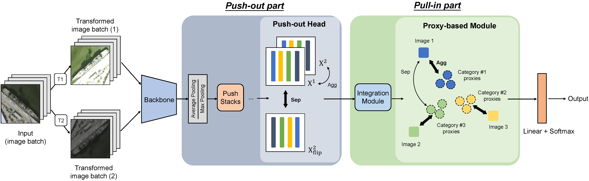

# P<sup>2</sup>Net


[](#License)

## Share us a :star: if this repo does help

The official implementation of "Contrastive Learning for Fine-grained Ship Classification in Remote Sensing Images". The paper can be accessed in [[IEEE](https://ieeexplore.ieee.org/document/9832938) | [Lab Server](http://levir.buaa.edu.cn/publications/CLFSC.pdf) | [ResearchGate](https://www.researchgate.net/profile/Keyan-Chen-6/publication/362119906_Contrastive_Learning_for_Fine-grained_Ship_Classification_in_Remote_Sensing_Images/links/62f47d37b8dc8b4403d4ce5c/Contrastive-Learning-for-Fine-Grained-Ship-Classification-in-Remote-Sensing-Images.pdf)]. ***(Accepted by TGRS 2022)***

If you encounter any question, please feel free to contact us. You can create an issue or just send email to me windvchen@gmail.com. Also welcome for any idea exchange and discussion.

## Updates
- ***2022/07/16***: The repository is now public.

- ***2022/06/09***: The code cleanup is finished and the complete codes are provided, also the weights of our model for FGSC-23 and FGSCR-42 datasets.

## Table of Contents

- [Introduction](#Introduction)
- [Results and Trained Model](#Results-and-Trained-Model)
- [Preliminaries](#Preliminaries)
- [Environments](#Environments)
- [Run Details](#Run-Details)
	- [Train Process](#Train-Process)
	- [Test Process](#Test-Process)
	- [Visualization](#Visualization)
- [Citation](#Citation)
- [License](#License)

## Introduction


We focus on the "imbalanced fineness" and "imbalanced appearances" in the fine-grained ship classification task in remote sensing images and propose **P<sup>2</sup>Net** to address the above issues. P<sup>2</sup>Net is a **weakly-supervised** method, and can be trained in an **end-to-end** way. Our P<sup>2</sup>Net can outperform many recent methods in the FGSC task.

## Results and Trained Model
### Models trained on augmented train dataset 
| Method | Params(M) |FLOPs(G) | FGSC-23 (AA) | FGSCR-42(AA) |
|:---|:---:|:---:|:---:| :---:|
| ResNet-50 | 23.6 | 4.12 | 86.92 | 91.62 |
| HBPNet``ECCV18 | 74.9 | 6.59 | 87.72 | 91.32 | 
| DCL``CVPR19 | 23.8 | 4.12 | 85.35 | 90.24 | 
| TASN``CVPR19 | 34.8 | 18.7 | 87.03 | 91.85 | 
| GFNet``NIPS20 | 56.5 | 4.59 | 87.13 | <ins>92.03</ins> | 
| API-Net``AAAI20 | 23.6 | 4.12 | <ins>87.78</ins> | 91.47 | 
| ProtoTree``CVPR21 | 108.8 | 20.7 | 84.17 | 89.92 | 
| **P<sup>2</sup>Net** | 26.9 | 4.23 | **88.99**<br />[[Google Drive](https://drive.google.com/file/d/1Yaa-VHnOoXnNakb-vP_3jxqwEbRw6TBd/view?usp=sharing) &#124; [Baidu Pan](https://pan.baidu.com/s/1uiWHu-MUT_w0VidEEEnH1g) (code:tr3i)]  | **93.21**<br />[[Google Drive](https://drive.google.com/file/d/1X_PtYD9nuuDX78ygru8Xq6lgd5y6u-PF/view?usp=sharing) &#124; [Baidu Pan](https://pan.baidu.com/s/12urPjzkmdynjv0P0R8CuPg) (code:nyro)] |

### Models trained on original train dataset without pre-augmentations
| Method | FGSC-23 (AA) | FGSCR-42(AA) |
|:---|:---:| :---:|
| ResNet-50 |  85.68 | 91.85 |
| HBPNet``ECCV18 |  <ins>86.09</ins> | 92.09 | 
| DCL``CVPR19 |  84.31 | 90.65 | 
| TASN``CVPR19 |  86.11 | 92.87 | 
| GFNet``NIPS20 |  85.37 | <ins>92.85</ins> | 
| API-Net``AAAI20 |  85.32 | 91.92 | 
| ProtoTree``CVPR21 |  80.46 | 79.14 | 
| **P<sup>2</sup>Net** | **88.56**<br />[[Google Drive](https://drive.google.com/file/d/1yY-Y0PCKj4yE9MtTSCPzopx7JLWJ0cSN/view?usp=sharing) &#124; [Baidu Pan](https://pan.baidu.com/s/1VbfXMtmivjatutIhAPirOw) (code:4qxh)] | **94.19**<br />[[Google Drive](https://drive.google.com/file/d/1XFPEouHjzbbePb1A4gXdrXaK0lzd2Wb8/view?usp=sharing) &#124; [Baidu Pan](https://pan.baidu.com/s/1OSsK1_edyhqjaGR0gFEM8Q) (code:v06g)] |

## Preliminaries
Please at first download datasets [FGSC-23](https://pan.baidu.com/s/1h_F7c-btLqhOxLT20XHWBg) [code:n8ra] or
[FGSCR-42](https://github.com/DYH666/FGSCR-42), then prepare the datasets as the 
following structure:
```
├── train
        ├── cls 1  # The first class
            ├── img_1.jpg  # The first image, for FGSCR-42 it should be '.bmp'
            ├── img_2.jpg
            ├── ...
        ├── cls 2
        ├── ...
├── valid
├── test
```
We provide [DatasetSplit.py](utils/DatasetSplit.py) to easily arrange the dataset into the above structure.

To overcome the imbalanced sample issue of the two datasets, you can make use of [customTransform.py](utils/customTransform.py) to augment the fewer-sample subclass in the train dataset. *(Please notice that the val/test dataset is not suggested to be augmented, and you can also choose not to augment the train dataset to see the performance of P<sup>2</sup>Net on the imbalanced sample issue.)* 

## Environments

- Windows/Linux both support
- python 3.8
- PyTorch 1.9.0
- torchvision
- pretrainedmodels
- wandb (Suggested, a good tool to visualize the training process. If not want to use it, you should comment out the related codes.)

## Run Details
### Train Process
To train our `P^2Net`, run:
```
# For FGSC-23 dataset
python PPNet.py --data FGSC23_path --epochs 100 --workers 4 --batch-size 64 --num_classes 23 --proxy_per_cls 3 --pretrained

# For FGSCR-42 dataset
python PPNet.py --data FGSCR242_path --epochs 100 --workers 4 --batch-size 64 --num_classes 42 --proxy_per_cls 2 --pretrained
```

To train the baseline, just add `--baseline`, run:
```
# For FGSC-23 dataset
python PPNet.py --data FGSC23_path --epochs 100 --workers 4 --batch-size 64 --num_classes 23 --pretrained --baseline

# For FGSCR-42 dataset
python PPNet.py --data FGSCR242_path --epochs 100 --workers 4 --batch-size 64 --num_classes 42 --pretrained --baseline
```

The architecture is ResNet-50 by default, and you can also change `--arch` to other architecture like `"densenet121"` or so on by your preference. The train results will be saved in model/expX.

### Test Process
Just add `--test` and determine `--test_model_path` when to conduct an inference.

To test our `P^2Net`, run:
```
# For FGSC-23 dataset
python PPNet.py --data FGSC23_path --epochs 100 --workers 4 --batch-size 64 --num_classes 23 --proxy_per_cls 3 --test --test_model_path model_path

# For FGSCR-42 dataset
python PPNet.py --data FGSCR42_path --epochs 100 --workers 4 --batch-size 64 --num_classes 42 --proxy_per_cls 2 --test --test_model_path model_path
```

To test the baseline, run:
```
# For FGSC-23 dataset
python PPNet.py --data FGSC23_path --epochs 100 --workers 4 --batch-size 64 --num_classes 23 --baseline --test --test_model_path model_path

# For FGSCR-42 dataset
python PPNet.py --data FGSCR42_path --epochs 100 --workers 4 --batch-size 64 --num_classes 42 --baseline --test --test_model_path model_path
```

### Visualization
We provide two visualization tools [drawCM.py](utils/drawCM.py) and [tsne.py](utils/tsne.py). You can make use of them and modify PPNet.py a bit to visualize the confusion matrix or t-SNE results.

## Citation
If you find this paper useful in your research, please consider citing:
```
@ARTICLE{9832938,  
 author={Chen, Jianqi and Chen, Keyan and Chen, Hao and Li, Wenyuan and Zou, Zhengxia and Shi, Zhenwei},  
 journal={IEEE Transactions on Geoscience and Remote Sensing},   
 title={Contrastive Learning for Fine-Grained Ship Classification in Remote Sensing Images},   
 year={2022},  
 volume={60},  
 number={},  
 pages={1-16},  
 doi={10.1109/TGRS.2022.3192256}}
```


## License
This project is licensed under the MIT License. See [LICENSE](LICENSE) for details
